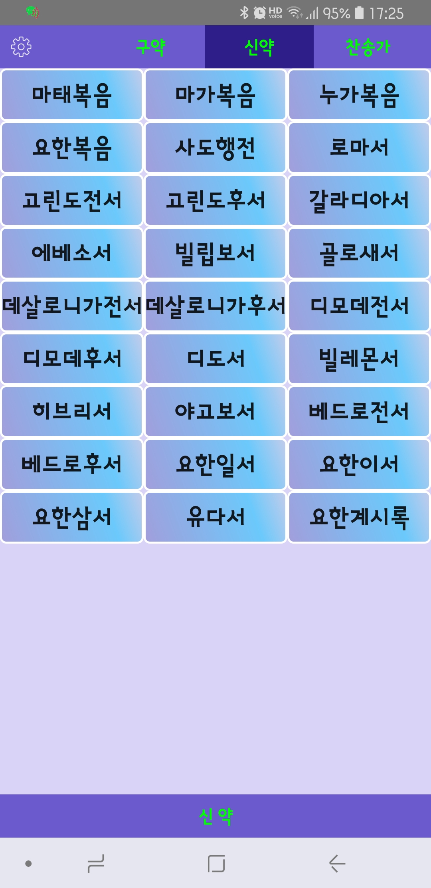
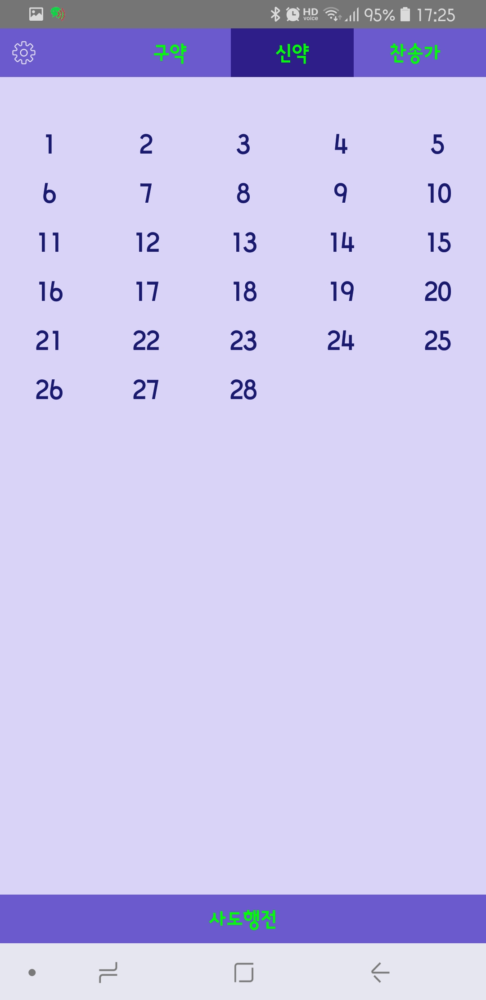
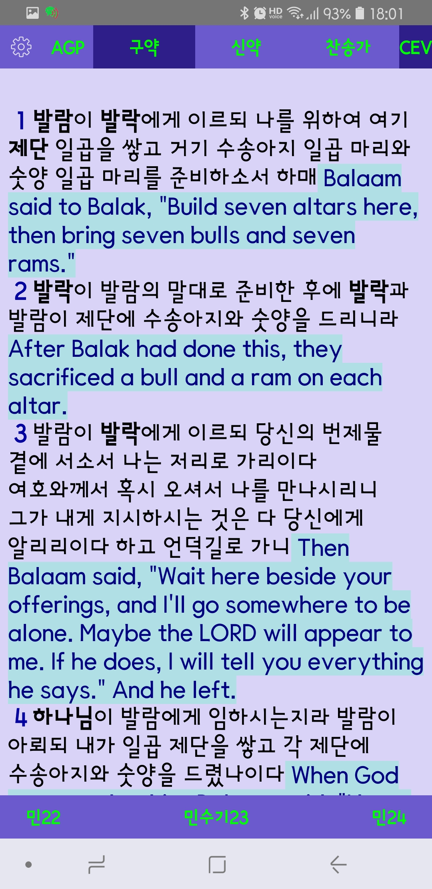
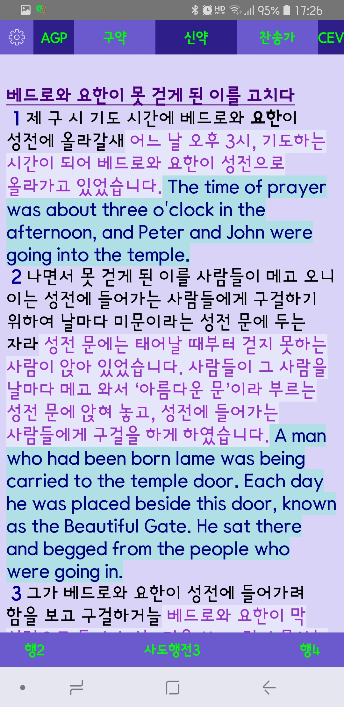
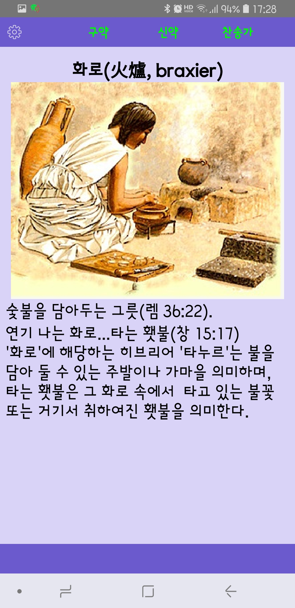
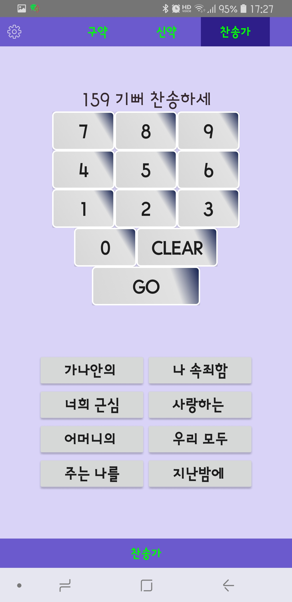
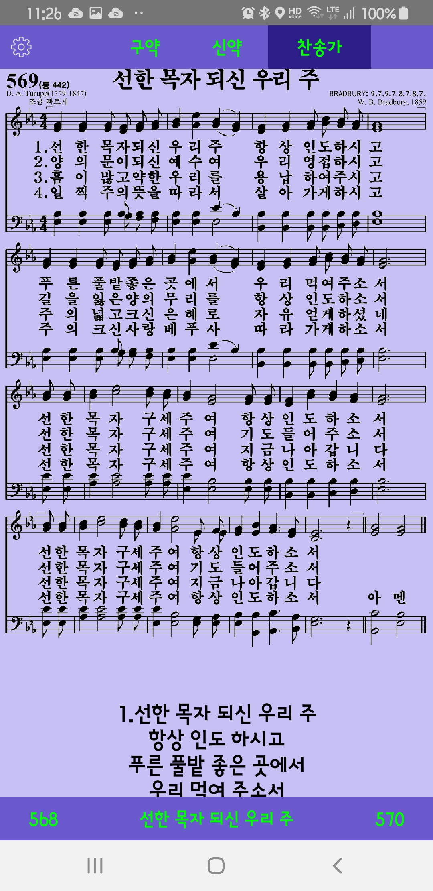
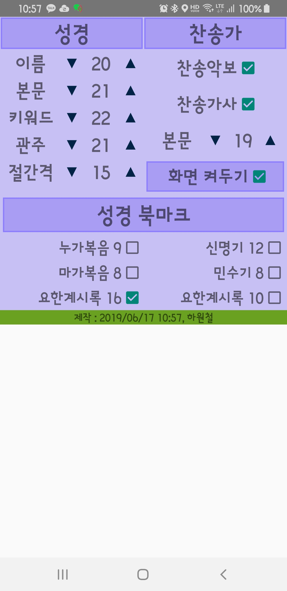

# my Holy Bible
**my Holy Bible** is the android application to show bibles and hymns

- It refers contents in '*/sdcard/myHolyBible*' folder (and contents are not included here ^^)
- It shows three scriptures by toggling AGP and/or CEV 
- You can change the font sizes, toggle hymn sheet musics, lyrics showing or not
- In scripture, if keyword is bolded, you can get keyword reference
- Bible crossing in smaller size is available
- Navigation history is provided
    
<H1>Screenshots and How to operate</H1>

<H3> Main Screen</H3>

- New testament List is shown when this application is launched
- You may select \<Setting>, \<Old testament>, \<New testament>, \<Hymn>
- By pressing any bible in bible list, it will lead to chapter selection list.

 &nbsp;&nbsp;&nbsp;&nbsp;&nbsp;&nbsp;&nbsp;&nbsp;&nbsp;&nbsp;&nbsp;&nbsp;

<H3>Chapter List</H3>

- To select chapter number of that bible.
- Bible name is at the bottom

 &nbsp;&nbsp;&nbsp;&nbsp;&nbsp;&nbsp;&nbsp;&nbsp;&nbsp;&nbsp;&nbsp;&nbsp;

<H3>Scripture Contents</H3>
 
- By pressing AGP and/or CEV, you can show other scriptures accordingly
- Paragraph name is displayed in bold and underlined style
- At the bottom, current Bible name and chapter is displayed
- Clicking left/right short bible name + chapter nuber will lead that chapter
- By clicking \(bible crossing) (short bible name + chapter number + verse number within parentheses), it will jump to relevant bible scripture

 &nbsp;&nbsp;&nbsp;&nbsp;&nbsp;&nbsp;&nbsp;&nbsp;&nbsp;&nbsp;&nbsp;&nbsp;

    

<H3>Keyword Reference</H3>
 
- If you click keyword (bolded in scripture), this screen will be displayed
- You may go back to scripture screen by clicking \<back> button on phone button menu or swiping left

 &nbsp;&nbsp;&nbsp;&nbsp;&nbsp;&nbsp;&nbsp;&nbsp;&nbsp;&nbsp;&nbsp;&nbsp;
    

<H3>Hymn Selection</H3>
 
- If you click \<Hymn>, you will have keypad to input Hymn number
- If pressed properly, hymn name will be displayed on the top of keypad
- You may go back to scripture screen by clicking \<back> button on phone button menu or swiping left
- If mistyped, start again with pressing \<clear> button
- If you know the Hymn title but not hymn number, you can choose by Hymn sorted list below Hymn Selection
 &nbsp;&nbsp;&nbsp;&nbsp;&nbsp;&nbsp;&nbsp;&nbsp;&nbsp;&nbsp;&nbsp;&nbsp;
    

<H3>Hymn Contents</H3>
 
- If you click \<Go> at Hymn selection, Hymn will be displayed
- By default, sheet musics and lyrics both will be displayed, you may make them visible/invisible on setting menu
- If you swipe left or right around phone buttom area, previous or next hymn will be displayed and it will be kept in navigation history.
- Hymn sheet musics is zoomable 

 &nbsp;&nbsp;&nbsp;&nbsp;&nbsp;&nbsp;&nbsp;&nbsp;&nbsp;&nbsp;&nbsp;&nbsp;
    

<H3>Hymn Sorted List</H3>
 
- This screen comes out when you click one of eight sorted list index button on Hymn Selection screen
- Hymn title is listed in alphabetically, and you may select the hymn number

 &nbsp;&nbsp;&nbsp;&nbsp;&nbsp;&nbsp;&nbsp;&nbsp;&nbsp;&nbsp;&nbsp;&nbsp;
    
    

<H3>Setting </H3>
 
- Thru this screen following items can be adjusted
- Bible: Bible Name Size, Scripture Size, Keyword Size, Cross-Ref Size, Verse space Size
- Hymn: Hymn Sheet and/or Hymn Lylic display, Lylic Size
- BookMarks : saved Bookmark list + keep save flag

 &nbsp;&nbsp;&nbsp;&nbsp;&nbsp;&nbsp;&nbsp;&nbsp;&nbsp;&nbsp;&nbsp;&nbsp;
    

<H3>Screen History Navigation</H3>
 
- Bible scripture and Hymn you selected will be remembered in history (not so many history)
- If you press \<back> on phone bottom menu or swipe left to right, previous screen will be displayed
- In the same way, by swiping right to left it will show next screen
- Swiping should be done about half or higher position on phone, lower part is used to go prev/next chapter or hymn number
    
<H1>Comments</H1>

<H3>Coded by</H3>

-  **Woncherl Ha** - riopapa@gmail.com

<H3>What I learned in this application</H3>

- SpannableString (with setSpan...),  Swipe Touch, Fragment Layout, Scrollable View

<H3>Updates / Changes</H3>

- 2019.02.07 : apply images zoomable ('com.commit451:PhotoView:1.2.4')

<H3>Issues not fixed yet</H3>

- Go prev/next thru navigation sometimes is not perfect, sorry :-p

<H3>Thanks all persons in GitHub for good examples.</H3>

